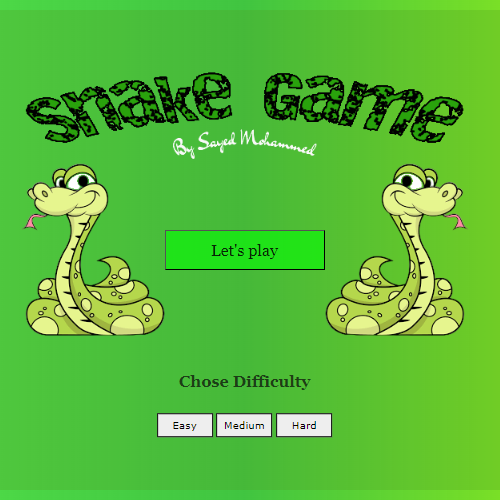

# The Snake Game By Sayed Mohammed

## Game description

The goal of Snake is to create a snake as long as possible. This is achieved by guiding the
snake to an apple on the game board. The snake cannot stop moving, and dies whenever
it hits something (excluding apples). Because the snake is growing longer and longer as
the game progresses, it gets increasingly difficult to avoid collisions with the snake itself.
The player can change the direction of the head of the snake by using the arrow keys & (W,A,S,D) Keys. At
step in the game, there is always an apple somewhere on the board. If the snake eats an
apple, the snake becomes one cell longer per step, for 3 steps. A new apple bounce is placed on
a random location. 

## Trello Link 
https://trello.com/b/ZvNhg601/project01

### Start Page 
</img>

### Game Screen
</img>

#### Game Simple Logic 
```javascript
//border 
var blockSize = 25
var rows = 24
var cols = 36
var border
var context
var score = 0

// Snake Head (x and y refers to X and Y cordenat the  snake will starts at cordenate 5,5 )
var snakeX = blockSize * 5
var snakeY = blockSize * 5
// cordinats
var velocityX = 0
var velocityY = 0

var snakeBody = []

// Food 
var foodX  
var foodY 
```
#### Game Loop And Start Game Logic
```javascript
// Game Loop , border condition and what will apear in start page 
function gameLoop() {
    border = document.getElementById("border")
    border.height = rows * blockSize
    border.width = cols * blockSize
    context = border.getContext("2d") //Used For Drawing on The Border

    placeFood()
    document.addEventListener("keyup",onKeyDown)
    // update()
    setInterval(update , interval) // Set Interval every 200 milliSecound will run the update  function
}
//When the pages loads (start page)
function startGame() {
    console.log("start Game")
    toggleScreen("start-screen" , false)
    toggleScreen("border" , true)
    gameLoop()
}
function toggleScreen(id, toggle) {
    let element = document.getElementById(id)
    let display = (toggle) ? "block" : "none"
    element.style.display = display
}
```
### Bounce Apple 
This was the most challenging part of the game and my favorite function,
calling the function for the bounce apple was easy but i stragel with calling it off 
so i need it to be despeer after consuming it or missing it 
so there is the code i made
``` javascript
// bounce apple variable
var bounceAppleX 
var bounceAppleY 

    // Food drawing Staring with the cordenate , then width and height
    context.fillStyle = "yellow"
    context.fillRect (bounceAppleX , bounceAppleY , blockSize , blockSize )

     // bounce apple condition ( when its reachs the scores minstions the yellow apple will apper {else will gone})
    if ((score === 5) || (score === 10) || (score === 15)) {
        placeBounce('inside')
    
    if (snakeX == bounceAppleX && snakeY == bounceAppleY) {
        
         drawScore();  // to add score each time the snake consume the food
        score +=3
        snakeBody.length +=3 
        bounce[0].play()
       // After eating the food let the snake grow
        snakeBody.push([bounceAppleX, bounceAppleY]) 
    }
} else {
    placeBounce('outside')
}
```

### Keys Function 
The Game Moves With Arrow Keys And (W,A,S,D) keys as will
So the Key part was easy but to prevent multiple key press at the same time thats the tricky part i solve it with (async await sleep )
the code is here .
``` javascript
  // change Diraction if you priss arrow key it will call Change Diraction  + added timing to prevent double key pressed

    async function onKeyDown(event){
              
        if (event.keyCode == 37 && velocityX !=1|| event.keyCode == 65 && velocityX !=1)
        {
        await sleep(100) 
        velocityX = -1
        velocityY = 0
        } 
        else if (event.keyCode == 38 && velocityY !=1 || event.keyCode == 87 && velocityY !=1) 
        { 
        await sleep(100)
        velocityX = 0
        velocityY = -1
        } 
        else if (event.keyCode == 39 && velocityX !=-1 || event.keyCode == 68 && velocityX !=-1) 
        { 
        await sleep(100)
        velocityX = 1
        velocityY = 0
        } 
        else if (event.keyCode == 40 && velocityY !=-1 || event.keyCode == 83 && velocityY !=-1) 
        { 
        await sleep(100)
        velocityX = 0
        velocityY = 1
        }  
               
    } 
```
## Winning condition & Game Over
So the way to win is basicaly you shoud earn 30 points from eating apples and to not hit the wall or the snake body which will call game over function
```javascript
// wining condition
    if ((score >= 30) && gameOver == false){
    gameOver = true    
    alert ("you Win")

    window.location.reload()
        return 
    }

    // GameOver Conditions
    // If the snake hit the wall (cols) alert Game Over
     if ((snakeX < 0 || snakeX > cols*blockSize -25 || snakeY < 0 || snakeY > rows*blockSize -25) && gameOver == false) {
        gameOver = true
        loses[0].play()
        console.log('lose')
        await sleep(200)
        alert("Game Over")
        

        window.location.reload()
        return null
    }
    // If the snake hit it's body alert Game over
    for (let i = 0; i < snakeBody.length; i++) {
        if (snakeX == snakeBody[i][0] && snakeY == snakeBody[i][1]) {
            gameOver = true
            loses[0].play() 
            await sleep(200)
            alert("Game Over")
            

            window.location.reload()
            return null
        }
    }

```

## Useful Resources
https://stackoverflow.com/questions/22825151/prevent-two-arrow-keys-from-outputting-if-pressed-at-same-time

https://stackoverflow.com/questions/25893125/toggle-button-color-with-addeventlistener

https://developer.mozilla.org/en-US/docs/Web/API/EventTarget/removeEventListener